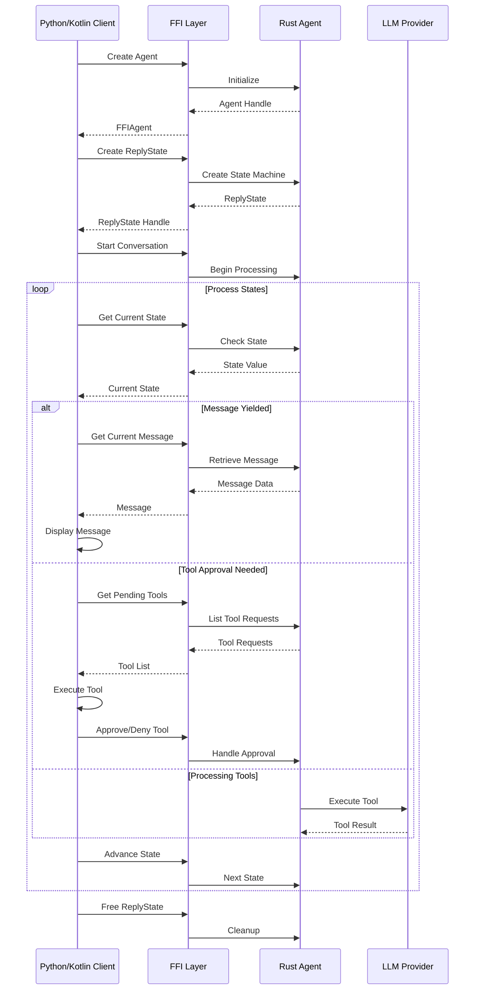
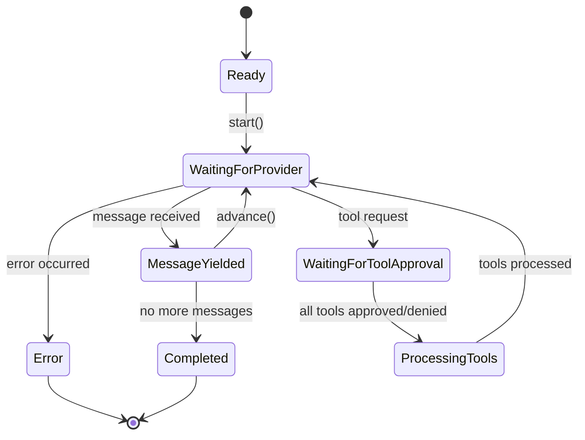
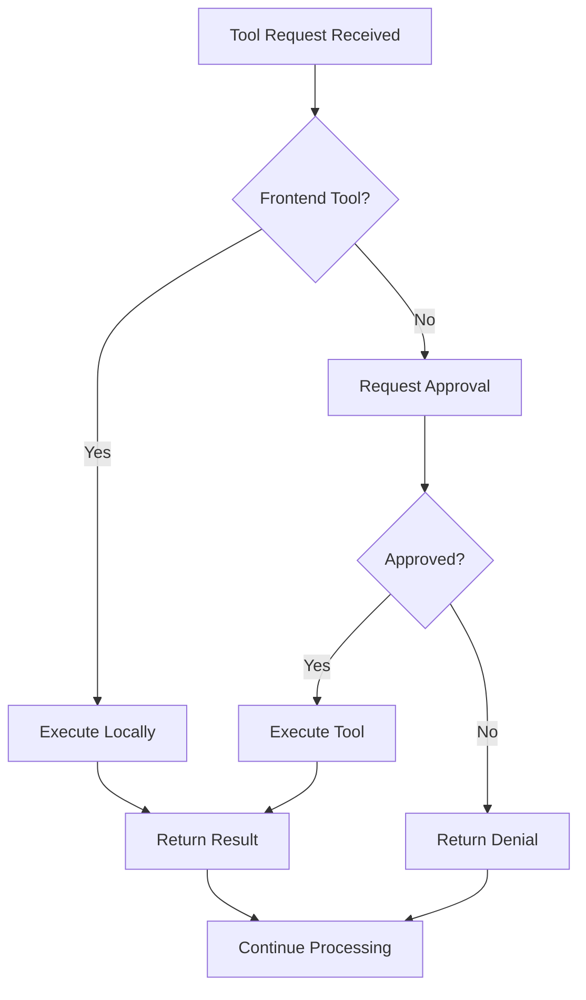

# FFI Agent Flow Diagram

```mermaid
sequenceDiagram
    participant Client as Python/Kotlin Client
    participant FFI as FFI Layer
    participant Agent as Rust Agent
    participant LLM as LLM Provider
    
    Client->>FFI: Create Agent
    FFI->>Agent: Initialize
    Agent-->>FFI: Agent Handle
    FFI-->>Client: FFIAgent
    
    Client->>FFI: Create ReplyState
    FFI->>Agent: Create State Machine
    Agent-->>FFI: ReplyState
    FFI-->>Client: ReplyState Handle
    
    Client->>FFI: Start Conversation
    FFI->>Agent: Begin Processing
    
    loop Process States
        Client->>FFI: Get Current State
        FFI->>Agent: Check State
        Agent-->>FFI: State Value
        FFI-->>Client: Current State
        
        alt Message Yielded
            Client->>FFI: Get Current Message
            FFI->>Agent: Retrieve Message
            Agent-->>FFI: Message Data
            FFI-->>Client: Message
            Client->>Client: Display Message
        else Tool Approval Needed
            Client->>FFI: Get Pending Tools
            FFI->>Agent: List Tool Requests
            Agent-->>FFI: Tool Requests
            FFI-->>Client: Tool List
            
            Client->>Client: Execute Tool
            Client->>FFI: Approve/Deny Tool
            FFI->>Agent: Handle Approval
        else Processing Tools
            Agent->>LLM: Execute Tool
            LLM-->>Agent: Tool Result
        end
        
        Client->>FFI: Advance State
        FFI->>Agent: Next State
    end
    
    Client->>FFI: Free ReplyState
    FFI->>Agent: Cleanup
```

## State Transitions

```mermaid
stateDiagram-v2
    [*] --> Ready
    Ready --> WaitingForProvider: start()
    WaitingForProvider --> MessageYielded: message received
    WaitingForProvider --> WaitingForToolApproval: tool request
    WaitingForProvider --> Error: error occurred
    MessageYielded --> WaitingForProvider: advance()
    MessageYielded --> Completed: no more messages
    WaitingForToolApproval --> ProcessingTools: all tools approved/denied
    ProcessingTools --> WaitingForProvider: tools processed
    Error --> [*]
    Completed --> [*]
```

## Tool Approval Flow

```mermaid
flowchart TD
    A[Tool Request Received] --> B{Frontend Tool?}
    B -->|Yes| C[Execute Locally]
    B -->|No| D[Request Approval]
    C --> E[Return Result]
    D --> F{Approved?}
    F -->|Yes| G[Execute Tool]
    F -->|No| H[Return Denial]
    G --> E
    H --> I[Continue Processing]
    E --> I
```